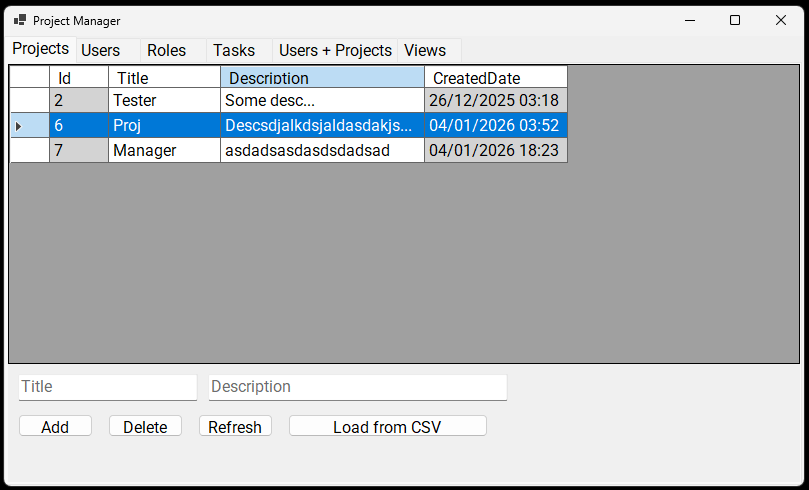
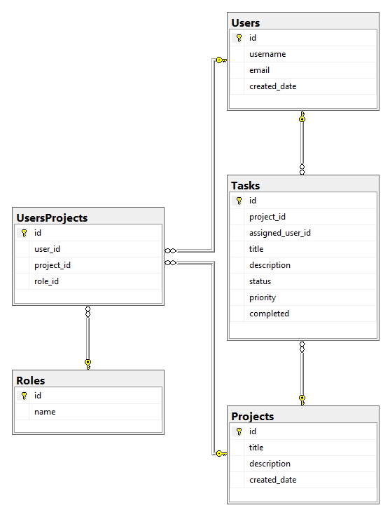

# PROJECT MANAGER
Application for managing projects and tasks written in `C# 14` (`.NET 10.0`).
Uses `Microsoft SQL Server` and for the user interface uses `WinForms`.

# Dependencies
- `.NET 10.0`
- `MSSQL` - Microsoft SQL Server

# How to Run
You need a Microsoft SQL Server for the database.

1. Create a database in MSSQL
2. Run the SQL from `init.sql` in your database (located on GitHub in `/ProjectManager/Database/init.sql`)

## Built
1. Download the latest build from **Releases**
2. In `appsettings.json` set the Connection string
3. Run `ProjectManager.exe`

## Self Built
1. Download the source code from GitHub
2. Open the `ProjectManager.sln` or manually open the project in your IDE
3. In `ProjectManager/appsettings.json` set the Connection string
4. Build and run

## Database
Uses Microsoft SQL Server.

### Diagram

## Used Libraries
- WinForms
- Microsoft.Data.SqlClient
- Microsoft.Extensions.Configuration
- Microsoft.Extensions.Configuration.Json
